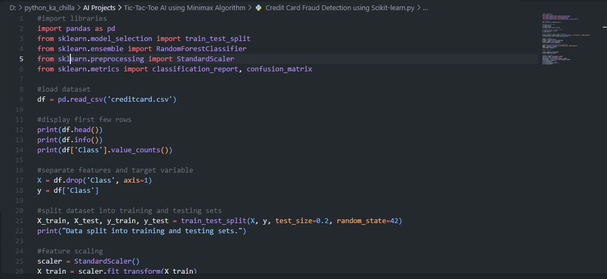
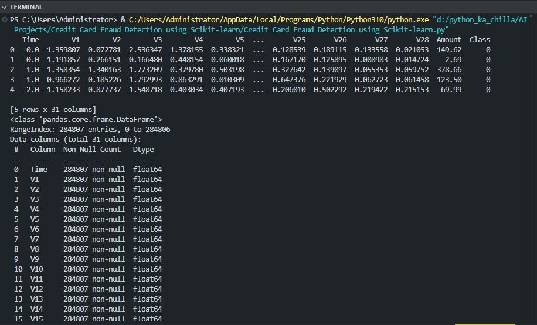

# 💳 Credit Card Fraud Detection using Scikit-Learn 🚨  
    

<p align="center">
  
</p>

🚀 This project builds a **machine learning model** to detect fraudulent credit card transactions using the **Random Forest classifier**. It preprocesses the dataset, scales features, trains the model, and evaluates performance using accuracy, confusion matrix, and classification report. The dataset used is the popular [Credit Card Fraud Detection dataset](https://www.kaggle.com/datasets/mlg-ulb/creditcardfraud) from Kaggle.

---

## ✨ Key Features  
📊 **Data Exploration** – Displays dataset info, class distribution, and first few rows  
⚙️ **Feature Scaling** – Standardizes features using `StandardScaler`  
🌲 **Random Forest Classifier** – Ensemble learning for robust classification  
📈 **Model Evaluation** – Accuracy, confusion matrix, and detailed classification report  
🔄 **Train-Test Split** – Splits data into training and testing sets (80/20)  
📉 **Handles Imbalanced Data** – The dataset is highly imbalanced, demonstrating real-world challenges  

---

## 🧠 Tech Stack  
- **Language:** Python 🐍  
- **Libraries:** pandas 🐼, scikit-learn 🔢  
- **Model:** Random Forest Classifier  
- **Preprocessing:** StandardScaler  
- **Evaluation:** Confusion Matrix, Classification Report  

---

## 📦 Installation  

```bash
git clone https://github.com/SayabArshad/Credit-Card-Fraud-Detection-ML.git
cd Credit-Card-Fraud-Detection-ML
pip install pandas scikit-learn
```

⚙️ Note: You need to download the creditcard.csv dataset from Kaggle and place it in the project folder.

---

## ▶️ Usage

Run the main script:

bash
python "Credit Card Fraud Detection using Scikit-learn.py"
The script will:

Load the dataset.

Display basic info and class distribution.

Split the data, scale features, and train a Random Forest model.

Print accuracy, confusion matrix, and classification report.

---

## 📁 Project Structure

```
Credit-Card-Fraud-Detection-ML/
│-- Credit Card Fraud Detection using Scikit-learn.py   # Main script
│-- creditcard.csv                                       # Dataset (user-provided)
│-- README.md                                             # Documentation
│-- assets/                                               # Images for README
│    ├── code.JPG
│    └── terminal.JPG
```

---

## 🖼️ Interface Previews

| 📝 Code Snippet | 📊 Console Output |
|:---------------:|:-----------------:|
|  |  |

---

## 💡 About the Project

Credit card fraud detection is a critical application of machine learning in the financial sector. This project demonstrates a complete pipeline: loading data, exploring it, preprocessing (feature scaling), training a Random Forest classifier, and evaluating its performance. The dataset is highly imbalanced (only 0.17% fraudulent transactions), which makes it a realistic challenge. The model achieves high accuracy, but further improvements could include handling imbalance with techniques like SMOTE or using more advanced algorithms.

---

## 🧑‍💻 Author

**Developed by:** [Sayab Arshad Soduzai](https://github.com/SayabArshad) 👨‍💻

📅 **Version:** 1.0.0

📜 **License:** MIT License


---

## ⭐ Contributions

Contributions are welcome! Fork the repository, open issues, or submit pull requests to enhance functionality (e.g., adding oversampling, trying other classifiers, or building a web interface).
If you find this project helpful, please ⭐ star the repository to show your support.

---

## 📧 Contact

For queries, collaborations, or feedback, reach out at **[sayabarshad789@gmail.com](mailto:sayabarshad789@gmail.com)**

---

💳 Fighting financial fraud with machine learning.
